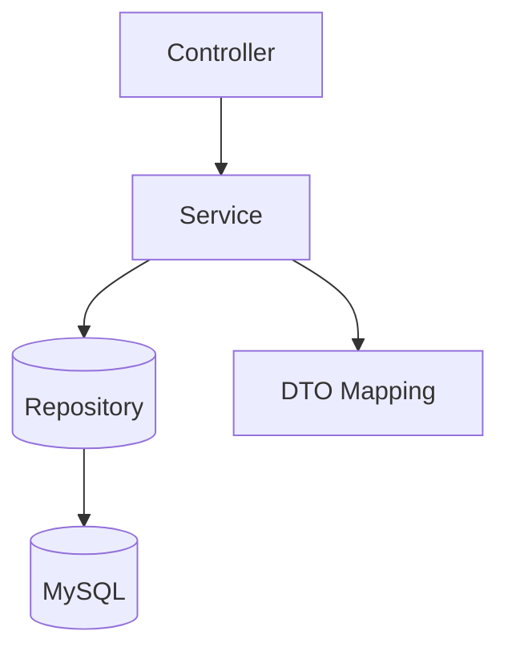

# MoneyCount

A Spring Boot 3 (Java 21) backend for personal finance management. Track incomes and expenses, organize them by categories, filter by date ranges/keywords, and surface dashboard insights for a user profile. JWT-based authentication-ready, MySQL persistence, and email integration.

## Features
- **Authentication-ready**: Spring Security + JWT libraries included
- **Income & Expense tracking**: CRUD operations per profile
- **Categories**: Assign categories to transactions
- **Dashboard**: Monthly totals, recent transactions, and quick insights
- **Filtering & search**: Date range + keyword, sortable results
- **Email integration**: Outbound email via SMTP
- **Layered architecture**: Controller → Service → Repository → Entity

## Tech Stack
- **Language**: Java 21
- **Framework**: Spring Boot 3.5.x (Web, Data JPA, Security, Mail)
- **Database**: MySQL
- **Build**: Maven
- **Utilities**: Lombok, JJWT

## Architecture


- Controllers in `src/main/java/in/SakshamProject/moneycount/controller/`
- Services in `src/main/java/in/SakshamProject/moneycount/service/`
- Entities in `src/main/java/in/SakshamProject/moneycount/entity/`
- Repositories in `src/main/java/in/SakshamProject/moneycount/repository/`

## Project Structure
```
src/main/java/in/SakshamProject/moneycount/
  ├─ controller/
  ├─ service/
  ├─ entity/
  ├─ repository/
  └─ ...
src/main/resources/
  ├─ application.properties
  ├─ static/
  └─ templates/
```

## Quick Start (Local)
1. **Prerequisites**
   - Java 21
   - Maven 3.9+
   - MySQL 8+ running locally

2. **Database**
   - Create a database (default used in dev):
     ```sql
     CREATE DATABASE Moneymanager CHARACTER SET utf8mb4 COLLATE utf8mb4_unicode_ci;
     ```

3. **Configure environment**
   - For local development, set the following env vars or update `application.properties` accordingly. Recommended to use env vars and keep secrets out of source control.

   | Name | Example |
   |------|---------|
   | `SERVER_PORT` | `8000` |
   | `DB_URL` | `jdbc:mysql://localhost:3306/Moneymanager` |
   | `DB_USERNAME` | `root` |
   | `DB_PASSWORD` | `your_password` |
   | `MAIL_HOST` | `smtp.gmail.com` |
   | `MAIL_PORT` | `587` |
   | `MAIL_USERNAME` | `your_email@gmail.com` |
   | `MAIL_PASSWORD` | `app_password` |
   | `JWT_SECRET` | base64-encoded secret |
   | `JWT_EXPIRATION` | `36000000` (10h in ms) |
   | `FRONTEND_URL` | `http://localhost:5173` |

   Spring Boot reads `application.properties`; you can externalize via environment variables (e.g., `SPRING_DATASOURCE_URL`, `SPRING_DATASOURCE_USERNAME`, etc.).

4. **Run the app**
   ```bash
   mvn spring-boot:run
   ```
   App will start on `http://localhost:8000` by default.

## Notable Endpoints
- **Income** (`IncomeController`)
  - `POST /incomes` – create income
  - `GET /incomes` – list current month incomes for current profile
  - `DELETE /incomes/{id}` – delete income by id (profile-guarded)

- Additional controllers exist for Expenses, Categories, Dashboard, Profile, Filters, and Email under `controller/`.

> Tip: Add Swagger/OpenAPI (springdoc) for interactive API docs.

## DTO Example (Income)
- `IncomeDTO` contains: `id`, `name`, `icon`, `categoryId`, `categoryName`, `ammount`, `date`, `createdAt`, `updatedAt`.
- `IncomeService` includes:
  - `addIncome(IncomeDTO)`
  - `getCurrentMonthIncomesFortheCurrentProfile()`
  - `getLatest5IncomeForCurrentUser()`
  - `getTotalIncomeForCurrentUser()`
  - `filterIncome(startDate, endDate, keyword, sort)`

## Configuration Notes
- JPA: `spring.jpa.hibernate.ddl-auto=update` for dev. Prefer Flyway/Liquibase for production.
- Mail: Use an app password for Gmail + enable STARTTLS.
- Security/JWT: `io.jsonwebtoken` libraries are included. Configure authentication filters and token issuance as needed.

## Development Tips
- Use Bean Validation annotations on DTOs and a global `@ControllerAdvice` for error handling.
- Add pagination on list endpoints to avoid large payloads.
- Consider Testcontainers for integration tests against MySQL.

## Roadmap / Nice-to-have
- API docs via Springdoc OpenAPI (`/swagger-ui.html`)
- Docker: `Dockerfile` + `docker-compose.yml` (app + MySQL)
- CI: GitHub Actions for build/test
- Flyway migrations

## Security Notice
If this repository has ever been public with real credentials in `application.properties`, immediately rotate those secrets (DB, email, JWT) and switch to environment variables or a non-committed config file (e.g., `application-example.properties`).

## License
This project is for educational and portfolio purposes. Add an explicit license if you plan to distribute.
